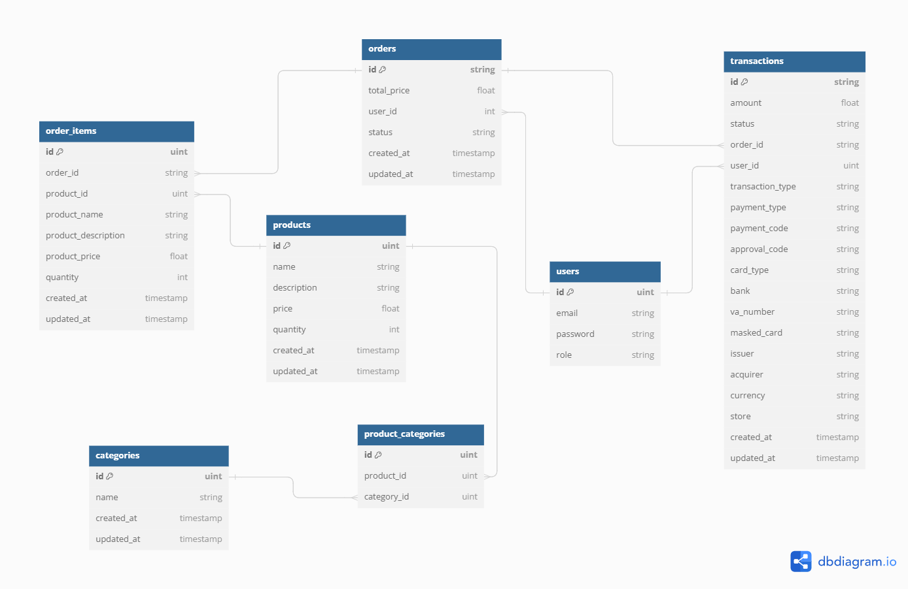

# Simple Marketplace Backend

This is a simple backend project for a marketplace with integration to Midtrans as a payment gateway. The project uses PostgreSQL as its database.

## Requirements

- Go-lang
- PostgreSQL
- Midtrans account for payment gateway integration
- [ngrok](https://ngrok.com/) for exposing local servers to the internet
- Docker and Docker Compose

## Setup Instructions

### 1. Clone the Repository

```bash
git clone https://github.com/pragusga25/synapsis-be.git
cd synapsis-be
```

### 2. Set Up Environment Variables

Create a `.env` file in the root of your project directory and add the following environment variables. Make sure to replace the placeholders with your actual credentials and configuration:

```ini
# Database Configuration
DB_HOST=your_postgresql_host
DB_PORT=your_postgresql_port
DB_USER=your_postgresql_user
DB_PASSWORD=your_postgresql_password
DB_NAME=your_database_name

# Midtrans Configuration
MIDTRANS_SERVER_KEY=your_midtrans_server_key

# Other Configuration
PORT=your_server_port
JWT_SECRET=yourjwtsecret
ENV=development
```

### 3. Run PostgreSQL Using Docker Compose

Ensure you have Docker and Docker Compose installed. Use the provided `docker-compose.postgresql.yaml` file to set up PostgreSQL:

```bash
docker-compose -f docker-compose.postgresql.yaml up -d
```

### 4. Install Dependencies

```bash
go mod tidy
```

### 5. Run the Application

```bash
fresh
```

The server should now be running on the port specified in your `.env` file.

### 6. Expose Local Server Using ngrok

To handle notifications from Midtrans, you need to expose your local server to the internet. You can use ngrok for this purpose.

Download and install ngrok from [here](https://ngrok.com/).

Run ngrok to expose your local server:

```bash
ngrok http <PORT>
```

Replace `<PORT>` with the port number your server is running on, which should match the `PORT` in your `.env` file. ngrok will provide you with a public URL that you can use for Midtrans notifications.

### 7. Configure Midtrans

Log in to your Midtrans account and set the notification URL to the public URL provided by ngrok followed by the notification endpoint of your application. For example:

```
https://<ngrok_public_url>/api/transactions
```

## Deployment Instructions

To deploy your application using Docker, follow these steps:

### 1. Create Docker Compose Deployment File

Ensure you have a `docker-compose.deploy.yaml` file with the following content:

```yaml
version: '3.8'

services:
  app:
    build: .
    ports:
      - '${PORT}:${PORT}'
    env_file:
      - .env
    depends_on:
      - db

  db:
    image: postgres:latest
    environment:
      POSTGRES_USER: ${DB_USER}
      POSTGRES_PASSWORD: ${DB_PASSWORD}
      POSTGRES_DB: ${DB_NAME}
    ports:
      - '${DB_PORT}:5432'
    volumes:
      - pgdata:/var/lib/postgresql/data

volumes:
  pgdata:
```

### 2. Deploy with Docker Compose

Run the following command to deploy your application:

```bash
docker-compose -f docker-compose.deploy.yaml up -d --build
```

This command will build the Docker image and start the services defined in your deployment file in detached mode.

### 3. Verify the Deployment

Check the status of your containers to ensure they are running correctly:

```bash
docker-compose -f docker-compose.deploy.yaml ps
```

Your application should now be running and accessible on the specified port.

## API Documentation

For detailed API documentation, please refer to the [Postman Documentation](https://documenter.getpostman.com/view/16401831/2sA3duGtTF).

## Entity Diagram



## Contributing

If you wish to contribute to this project, please follow these steps:

1. Fork the repository.
2. Create a new branch (`git checkout -b feature-branch`).
3. Make your changes and commit them (`git commit -am 'Add new feature'`).
4. Push to the branch (`git push origin feature-branch`).
5. Create a new Pull Request.

## License

This project is licensed under the MIT License - see the [LICENSE](LICENSE) file for details.
